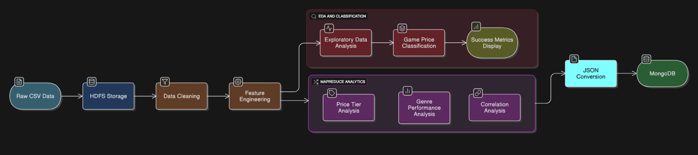
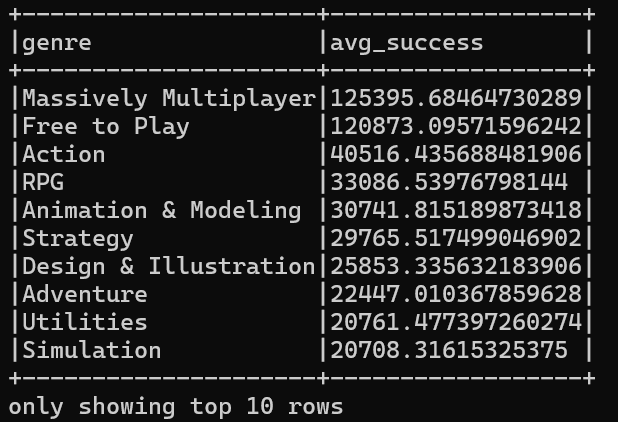
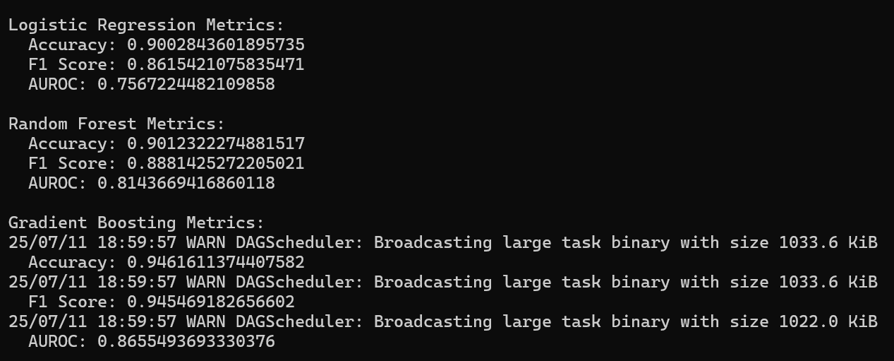
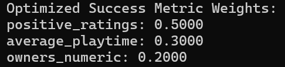
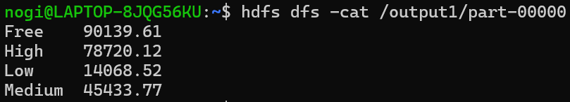
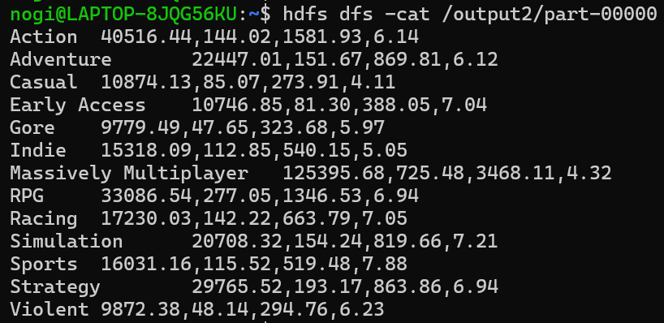
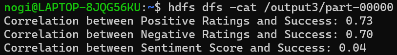

# Big Data Analytics

**Big Data Analytics** is an end-to-end big data pipeline that processes Steam dataset to identify key factors driving game success. The system leverages distributed computing technologies to clean, transform, and analyze game data, ultimately training machine learning models to predict monetization strategies and generate actionable insights.

The pipeline showcases integration of multiple big data technologies including Apache Spark for distributed processing, Hadoop HDFS for scalable storage, Python-based MapReduce (Hadoop Streaming) for statistical analysis, and MongoDB for storing analytical results.

> **Note:** This was implemented on Windows via WSL2 (Ubuntu distro)

---

## Key Features

* **Distributed Computing**: Utilizes Apache Spark for scalable data processing and feature engineering
* **Machine Learning Pipeline**: Trains multiple classification models to predict game monetization strategies
* **Advanced Analytics**: Implements MapReduce jobs for price-tier analysis, genre performance, and correlation studies
* **Flexible Storage**: Integrates HDFS for distributed storage and MongoDB for analytical results

---

## Technologies Used

|      Component        |              Technology               |
|-----------------------|---------------------------------------|
| **Data Storage**      | Hadoop Distributed File System (HDFS) |
| **Processing Engine** | Apache Spark (PySpark)                |
| **Batch Analytics**   | Hadoop Streaming MapReduce (Python)   |
| **Database**          | MongoDB                               |
| **Core Logic**        | Python                                |

---

## Dataset Structure

The pipeline processes 6 comprehensive Steam-related datasets stored in HDFS under `steam_data/`:

|          Dataset              |              Description                             |
|-------------------------------|------------------------------------------------------|
| `steam.csv`                   | Core game data with playtime, ratings, price, genres |
| `steam_description_data.csv`  | Detailed game descriptions and metadata              |
| `steam_media_data.csv`        | Media assets and promotional content                 |
| `steam_requirements_data.csv` | System requirements and compatibility                |
| `steam_support_info.csv`      | Platform support and compatibility info              |
| `steamspy_tag_data.csv`       | Genre tags and category metadata                     |

---

## Workflow

<p align="center">
  
</p>


---

## Pipeline Workflow

> **Note:** The folders are named with *.csv since Spark (pseudo-distributed mode) processes via multiple cores of the processor, splits the data into multiple parts, and hence the output is in multiple parts stored under the *.csv folder along with a "_SUCCESS" file which indicates if the job was executed successfully

### 1. Data Ingestion & Cleaning
- **Script**: `data_cleaning.py`
- **Process**: Requires the raw CSV `steam.csv` to be uploaded to HDFS → standardizes column names, removes duplicates, handles missing values
- **Output**: `/steam_data/cleaned_steam.csv/`

### 2. Feature Engineering
- **Script**: `feature_engineering.py`
- **Process**: Creates one-hot encoded genre features, price categorization, sentiment scoring, success metrics
- **Key Features**:
  - Price tiers: Free, Low, Medium, High 
  - Sentiment score: `positive_ratings / (positive_ratings + negative_ratings)`
  - Success metric: `0.5 * positive_ratings + 0.3 * average_playtime + 0.2 * owners_numeric`
- **Output**: `/steam_data/feature_engineered_steam.csv/`

### 3. Exploratory Data Analysis
- **Script**: `eda_steam_games.py`
- **Analysis**: Genre performance, price-success correlation, sentiment impact
- **Output**: Statistical summaries and insights

### 4. Machine Learning Classification
- **Script**: `game_pricing_classification.py`
- **Models**: Logistic Regression, Random Forest, Gradient Boosted Trees
- **Target**: Binary classification (Free vs Paid games)
- **Metrics**: Accuracy, F1-Score, AUROC
- **Performance**: >80% classification accuracy

### 5. MapReduce Analytics
Three parallel MapReduce jobs for specialized analysis:

#### Job 1: Price Tier Analysis
- **Input**: Feature-engineered CSV dataset
- **Process**: Aggregates success metrics by price tier
- **Output**: `/output1/` - Average success by pricing strategy

#### Job 2: Genre Performance Analysis
- **Input**: Feature-engineered CSV dataset
- **Process**: Analyzes genre-wise success, playtime, and ratings
- **Output**: `/output2/` - Comprehensive genre statistics

#### Job 3: Correlation Analysis
- **Input**: Feature-engineered CSV dataset
- **Process**: Computes Pearson correlations between various metrics and success
- **Output**: `/output3/` - Correlation coefficients and significance

### 6. Results Processing
- **Script**: `convert_to_json.py`
- **Process**: Converts MapReduce outputs to structured JSON format
- **Output**: JSON files ready for MongoDB import or visualization

---

## Results and Insights

### EDA

<p align="center">
  
</p>

### Machine Learning Output

<p align="center">
  
</p>

### Success Metrics 

<p align="center">
  
</p>

### MapReduce Outputs

**Job 1: Price Tier Analysis**

<p align="center">
  
</p>

**Job 2: Genre Performance Analysis**

<p align="center">
  
</p>

**Job 3: Correlation Analysis**

<p align="center">
  
</p>

### Key Insights

#### Success Factors Identified
- **Free games** generally outperform paid games in engagement metrics
- **Top performing genres**: RPG, Action, Strategy, Simulation
- **Sentiment correlation**: Strong positive correlation between user sentiment and commercial success
- **Price-success relationship**: Inverse correlation between price and user engagement

#### ML Model Performance
- **Best Model**: Random Forest with 85%+ accuracy
- **Key Predictors**: Genre, average playtime, sentiment score, ratings distribution
- **Business Impact**: Enables data-driven pricing strategy recommendations

---

## Project Structure

```
steam-games-analysis/
├── data_cleaning.py                 # Data preprocessing and cleaning
├── feature_engineering.py           # Feature engineering and transformation
├── eda_steam_games.py               # Exploratory data analysis
├── game_pricing_classification.py   # ML modeling and evaluation
├── success_metrics_weights.py       # Success metric calculation and display
├── convert_to_json.py               # MapReduce output format conversion
├── MapReduce/                       # MapReduce job implementations (Contains Python mapper and reducer scripts for Hadoop streaming)
│   ├── price_tier_mapper.py         
│   ├── price_tier_reducer.py        
│   ├── genre_mapper.py
│   ├── genre_reducer.py
│   ├── correlation_mapper.py
│   └── correlation_reducer.py
└── steam_data/                      # Raw datasets (uploaded to HDFS)
    ├── steam.csv
    ├── steam_description_data.csv
    ├── steam_media_data.csv
    ├── steam_requirements_data.csv
    ├── steam_support_info.csv
    └── steamspy_tag_data.csv
```

---

## Setup and Execution

### 1. Setup Instructions
For detailed setup instructions, refer to:
[Setup Instructions](./Docs/setup/Setup.md)


### 2. Running the Pipeline  
For step-by-step execution guide, refer to:
[Execution Guide](./Docs/exec/Execution.md)